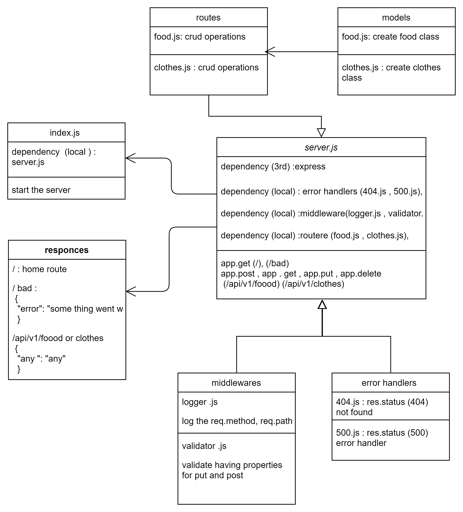

# cloud-server

this project is a practice prioject for lab 16 of 401 course at asac , from lab 03 server

**Author** : hiba salem

- ### description

Deploy a Node.js server to AWS EC2

---

- ### [pull request](https://github.com/hibasalem/cloud-server/pull/1)

- ### deploy links

  - [GUI deploy link](http://cloudserver-env.eba-eiv77qmg.us-east-1.elasticbeanstalk.com/)





- ### getting this app

  - clone and npm i --production.
  - npm start or nodemon

---

- ### Setup

  - `.env requirements`
  - `PORT` - Port Number

---

- ### end points

  - `/api/v1/clothes` or `/api/v1/clothes`
  - get

  ```
    [
        {
            "id": "819a8ef6-ceee-4252-bfab-6de4a94a3c1a",
            "data": {
                "any": "any"
            }
        }
    ]

  ```

  - `/api/v1/clothes/${id}` or `/api/v1/clothes/${id}`
  - get

  ```
        {
            "id": "${id}",
            "data": {
                "test2": "test"
            }
        }

  ```

  - `/api/v1/clothes` or `/api/v1/clothes`
  - post
  - send in the body `{"any": "any"}`

  ```
    {
        "id": "any",
        "data": {
            "any": "any"
        }
    }

  ```

  - `/api/v1/clothes${id}` or `/api/v1/clothes${id}`
  - put
  - send in the body `{"any": "any"}`

  ```
    {
        "id": "${id}",
        "data": {
            "any": "any"
        }
    }

  ```

  - `/api/v1/clothes${id}` or `/api/v1/clothes${id}`
  - delete

  ```
  "undefind"

  ```

  - `/`

  ```

  {
  home route
  }

  ```

  - `/bad`

  ```

  {
  "error": "some thing went wrong"
  }

  ```

---
